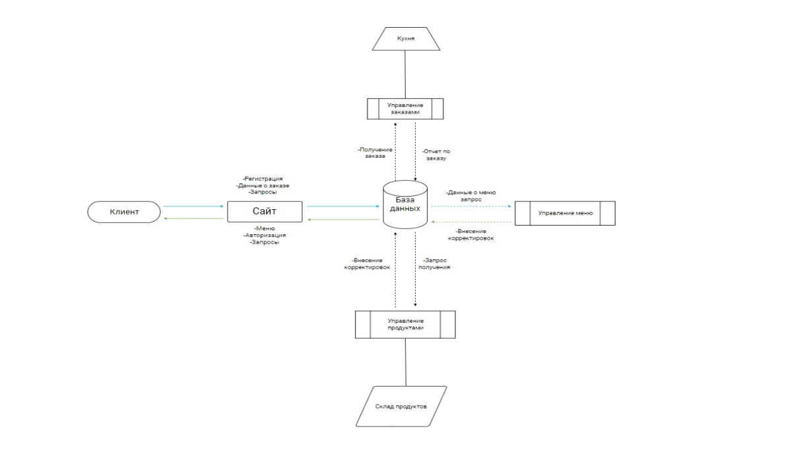

# PizzaWell-web

**Функциональный сайт с корзиной, оплатой и регистрацией**

Проект представляет собой веб-приложение для онлайн-заказа пиццы, включая функциональность корзины, системы оплаты и регистрации пользователей.

---

## Показ сайта

Просмотр сайта в действии:

[Посмотреть видео](https://disk.yandex.ru/i/6-AG-L2fjfOwHw) (3:04)

---

## Отдельные десктоп-приложения

### 1. **Управление заказами**
Просмотр видео с функциональностью управления заказами:
[Посмотреть видео](https://disk.yandex.ru/i/SDGLDIDpip7U3A) (0:55)

### 2. **Управление меню**
Просмотр видео с функциональностью управления меню:
[Посмотреть видео](https://disk.yandex.ru/i/EO_EDQpB9SgKmA) (2:03)

### 3. **Управление продуктами**
Просмотр видео с функциональностью управления продуктами:
[Посмотреть видео](https://disk.yandex.ru/i/pXOZf0n9nOawPQ) (1:43)

## Схема базы данных

  

---

## Блок-схема проекта

  

